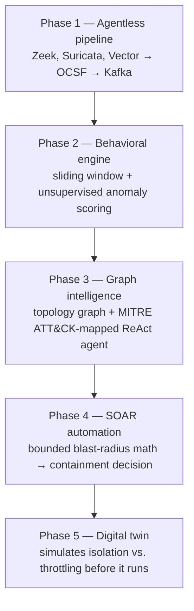

# CNI Cyber Resilience Platform

Autonomous threat detection, reasoning, and response for critical national
infrastructure (CNI) — networks that mix regular IT with industrial OT gear
(PLCs, SCADA, RTUs) where a compromise can cascade into physical-world
consequences, not just a data breach.

Built for the Economic Times hackathon.

## The problem

IT/OT environments are watched by tools built for one world or the other,
rarely both — and industrial protocols (Modbus, DNP3, IEC 104) usually can't
run a security agent at all. Analysts end up manually correlating alerts
across silos while an attacker moves laterally in the gap. This project is an
end-to-end pipeline that watches both sides passively, reasons about
blast radius before acting, and only takes irreversible action when it's
provably safe to.

## Architecture



| Phase | Folder | What it does |
|---|---|---|
| 1. Agentless pipeline | `agentless_pipeline/` | Passively watches mirrored IT/OT traffic, normalizes to OCSF |
| 2. Behavioral engine | `behavioral_engine/` | Per-asset sliding window + unsupervised anomaly scoring |
| 3. Graph intelligence | `graph_intelligence/` | Topology graph, blast-radius traversal, MITRE-mapped reasoning agent |
| 4. SOAR automation | `soar_automation/` | Decides autonomous isolation vs. throttling vs. monitor-only |
| 5. Digital twin | `resilience_twin/` | Clones the topology and compares response playbooks before committing |

## What's live vs. simulated right now

Being upfront about this because it matters:

- **Real, live computation:** graph traversal, blast-radius scoring, the SOAR
  decision matrix, the digital twin comparison, and the ReAct reasoning agent
  in `app.py` all run the actual project code — nothing here is hardcoded
  output.
- **Simulated input:** the dashboard's main incident scenarios let you set
  the anomaly score directly (via preset or slider) rather than sourcing it
  from live network traffic, since Phase 1 isn't wired to a real Kafka
  cluster in this demo.
- **Also real, run on demand:** the "Live Phase 1 → Phase 2 pipeline test"
  panel in the app generates raw Zeek-style connection telemetry, runs it
  through the actual OCSF normalizer and schema validator in
  `agentless_pipeline/`, then feeds the normalized output into the real
  behavioral-engine pipeline (sliding window → feature extraction → adaptive
  scoring) — independent of the incident-scenario controls, to show that
  chain working end to end. One caveat: this normalizer path doesn't carry
  byte volume through from Zeek conn logs, so scoring there draws on timing
  and port-diversity drift rather than payload size.
- **Not yet wired together:** there's no continuous process streaming live
  Kafka output through all five phases yet (see `orchestrator.py` below for
  the closest thing to it, using replayed sample telemetry instead of a
  live broker).

## Full pipeline demo: `orchestrator.py`

A single-process reference implementation that wires all 5 phases together
end to end, without requiring a live Kafka cluster:

```bash
python orchestrator.py                 # 2 replay cycles, readable pace
python orchestrator.py --cycles 5 --delay 0.1
```

It replays the project's own sample sensor telemetry
(`agentless_pipeline/simulator/sample_inputs/`) through the real Phase 1
normalizer and schema validator, warms up a genuine behavioral baseline,
scores live traffic through Phase 2, and — when a confirmed Suricata alert
or a behavioral score crosses threshold — runs the real Phase 3 reasoning
agent, Phase 4 SOAR decision, and Phase 5 digital twin comparison, printing
a live SOC console feed and a run summary. `iter_raw_events()` is the seam
where a real Kafka consumer would plug in later.

## Human-in-the-loop approval

When the SOAR engine's decision requires human validation (blast radius too
high to isolate autonomously), `app.py` now shows **Approve** / **Reject**
buttons instead of just displaying the flag. Approving confirms the
throttling action; rejecting escalates it for manual response. Both are
logged to the session's incident log.

## Why this matters

- Median attacker dwell time after initial compromise: **14 days** in 2025,
  up from 11 days (Mandiant M-Trends 2026)
- Average cost of a critical-infrastructure data breach: **$4.82M**
  (IBM Cost of a Data Breach Report 2025)
- Containing a breach in under 200 days instead of longer saves organizations
  an average of **$1.14M** (IBM 2025)

The gap between a 14-day median dwell time and a graph-traversal + SOAR
decision that runs in milliseconds is what this prototype is aimed at
closing.

## Running it

```bash
pip install -r requirements.txt
streamlit run app.py
```

The dashboard opens with a preset incident already loaded. Switch scenarios
or drag the Custom-mode sliders in the sidebar to see the SOAR engine's
decision change live.

### Optional: MCP server

`mcp_server.py` exposes Phases 2–5 as tools an LLM agent can call (score
telemetry, correlate a graph attack path, orchestrate containment, run a
digital twin simulation). Requires `fastmcp`:

```bash
python mcp_server.py
```

## Project structure

```
.
├── app.py                     # Streamlit dashboard (start here)
├── orchestrator.py              # Full 5-phase pipeline, run end to end
├── mcp_server.py               # Optional: agentic MCP tool bridge
├── requirements.txt
├── agentless_pipeline/          # Phase 1
├── behavioral_engine/            # Phase 2
├── graph_intelligence/            # Phase 3
├── soar_automation/                # Phase 4
└── resilience_twin/                 # Phase 5
```

Each phase folder has its own `README.md` and a standalone `test_*.py` you
can run directly to see that phase validated in isolation.